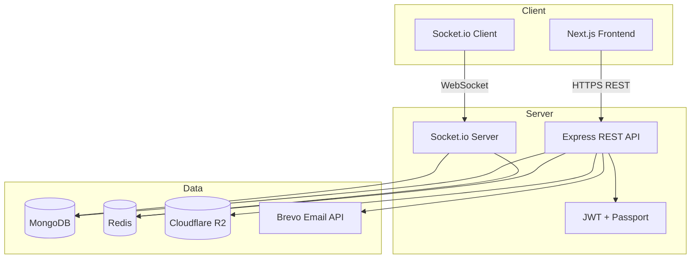

# Lost & Found

A full-stack community platform for reporting lost items, sharing found belongings, and helping people reconnect with what matters. Users can post listings with photos and location, browse nearby reports, claim items, message owners privately, and track activity from a personal dashboard.

**Live deployments (example):**
- Frontend: [https://lost-found-complete.vercel.app](https://lost-found-complete.vercel.app)
- Backend API: [https://lostfoundcomplete.onrender.com](https://lostfoundcomplete.onrender.com)

---

## Table of Contents

- [Features](#features)
- [Tech Stack](#tech-stack)
- [Architecture](#architecture)
- [Project Structure](#project-structure)
- [Data Models](#data-models)
- [API Reference](#api-reference)
- [Real-Time Messaging (Socket.io)](#real-time-messaging-socketio)
- [Authentication Flow](#authentication-flow)
- [Environment Variables](#environment-variables)
- [Local Development](#local-development)
- [Deployment](#deployment)
- [Security](#security)
- [UI & Design System](#ui--design-system)
- [Production Checklist](#production-checklist)
- [Troubleshooting](#troubleshooting)
- [License](#license)

---

## Features

### For everyone
- Browse lost and found listings with search, filters, and sorting
- View item details with image gallery, location, poster info, and reward
- Responsive, calm UI designed for trust and readability

### For registered users
- **Auth:** Email/password signup, email verification, Google OAuth, JWT sessions
- **Listings:** Post lost or found items with up to 5 images, map-based location, tags, and optional reward
- **Claims:** Submit ownership claims on items; owners accept or reject
- **Bookmarks:** Save items for later
- **Messaging:** Real-time private chat tied to item conversations (Socket.io)
- **Dashboard:** Stats, recent activity, success rate, pending claims
- **Profile:** Avatar upload, trust score, badges, account deactivation
- **My Items / Saved:** Manage your posts and bookmarked listings

### Platform capabilities
- Geo search (MongoDB 2dsphere indexes)
- Cloudflare R2 media storage with local disk fallback
- Brevo transactional email (verification + welcome)
- Redis-backed rate limiting and caching (graceful degradation if Redis is down)
- Security headers, request logging, health checks for Render

---

## Tech Stack

| Layer | Technology |
|-------|------------|
| **Frontend** | Next.js 16 (App Router), React 19, TypeScript, Tailwind CSS 4 |
| **Backend** | Node.js 18+, Express 5, ES Modules |
| **Database** | MongoDB (Mongoose 9) |
| **Cache / Rate limit** | Redis (ioredis) |
| **Real-time** | Socket.io 4 |
| **Auth** | JWT, bcrypt, Passport Google OAuth 2.0 |
| **Email** | Brevo HTTP API |
| **File storage** | Cloudflare R2 (S3-compatible) + local uploads |
| **Maps** | Leaflet + OpenStreetMap (client-side) |
| **Deploy** | Vercel (frontend), Render (backend) |

---

## Architecture



**Request flow (typical):**
1. User interacts with the Next.js frontend (Vercel).
2. REST calls go to the Express API (Render) with `Authorization: Bearer <JWT>`.
3. Protected routes validate JWT via `auth.middleware.js`.
4. MongoDB stores users, items, and messages.
5. Images upload to R2 (or `backend/uploads/` locally).
6. Chat uses Socket.io with room-based delivery (`user:<id>`).

---

## Project Structure

```
LostFoundComplete/
├── backend/
│   ├── src/
│   │   ├── app.js                 # Express app, CORS, routes, health checks
│   │   ├── server.js              # HTTP server + Socket.io bootstrap
│   │   ├── config/
│   │   │   ├── db.js              # MongoDB connection
│   │   │   ├── redis.js           # Redis client + health
│   │   │   ├── socket.js          # Socket.io events
│   │   │   ├── passport.js        # Google OAuth strategy
│   │   │   └── r2.js              # Cloudflare R2 uploads
│   │   ├── controllers/           # Route handlers
│   │   ├── middlewares/           # Auth, rate limit, security, errors
│   │   ├── models/                # Mongoose schemas (User, Item, Message)
│   │   ├── routes/                # API route definitions
│   │   ├── services/              # Business logic + email
│   │   └── utils/                 # Cache helpers, media resolution
│   ├── uploads/                   # Local upload fallback (gitignored)
│   └── package.json
│
├── frontend/
│   ├── app/                       # Next.js App Router pages
│   │   ├── page.tsx               # Landing
│   │   ├── login/ signup/         # Auth
│   │   ├── explore/               # Browse listings
│   │   ├── post/                  # Create listing
│   │   ├── item/[id]/             # Item detail
│   │   ├── dashboard/             # User stats
│   │   ├── messages/              # Real-time chat
│   │   ├── profile/ saved/ my-items/
│   │   ├── verify-email/ auth/callback/
│   │   └── globals.css            # Design tokens + shared UI
│   ├── components/
│   │   ├── Navigation.tsx
│   │   └── MapSelector.tsx        # Leaflet map picker
│   ├── contexts/
│   │   └── SocketContext.tsx      # Global socket connection
│   └── lib/
│       ├── auth.ts                # JWT localStorage helpers
│       └── config.ts              # API + socket URLs
│
├── PRODUCTION.md                  # Ops checklist
└── README.md                      # This file
```

---

## Data Models

### User
| Field | Description |
|-------|-------------|
| `username`, `email`, `password` | Credentials (password hashed with bcrypt) |
| `profilePicture` | Avatar URL (R2 or local) |
| `location` | GeoJSON Point for user location |
| `trustScore`, `badges`, `recoveryCount` | Reputation metrics |
| `isVerified` | Email verification status |
| `role` | `user` or `admin` |

### Item
| Field | Description |
|-------|-------------|
| `title`, `description`, `type` | `lost` or `found` |
| `category`, `subCategory`, `tags` | Classification |
| `location` | Address, city, area, GeoJSON coordinates |
| `images` | Up to 5 image URLs |
| `reward` | Optional amount + currency (PKR default) |
| `postedBy` | Owner reference |
| `status` | `active`, `resolved`, `expired`, `archived` |
| `claims[]` | Ownership claims with pending/accepted/rejected |
| `bookmarks[]`, `views`, `reports[]` | Engagement |

### Message
| Field | Description |
|-------|-------------|
| `conversationId` | `{userA}_{userB}` or `{userA}_{userB}_{itemId}` |
| `sender`, `recipient` | User references |
| `content` | Message text |
| `itemReference` | Optional linked item |
| `isRead`, `readAt` | Read receipts |
| `hiddenBy[]` | Per-user conversation hide |

---

## API Reference

Base URL: `http://localhost:4500` (dev) or your Render URL (prod).

All protected routes require:
```http
Authorization: Bearer <JWT_TOKEN>
Content-Type: application/json
```

### Health
| Method | Path | Auth | Description |
|--------|------|------|-------------|
| GET | `/` | No | Health check (Render probe) |
| GET | `/healthz` | No | Health check with Mongo + Redis status |

### Auth — `/auth/api`
| Method | Path | Auth | Description |
|--------|------|------|-------------|
| POST | `/login` | No | Login → `{ token, user }` |
| POST | `/register` | No | Signup → creates user, sends verification email |
| GET | `/verify-email?token=` | No | Verify email address |
| GET | `/profile` | Yes | Current user profile |
| GET | `/user/:userId` | Yes | Public user info by ID |
| PUT | `/profile` | Yes | Update profile |
| POST | `/profile/upload` | Yes | Upload profile picture (multipart) |
| POST | `/profile/deactivate` | Yes | Deactivate account |
| GET | `/google` | No | Start Google OAuth |
| GET | `/google/callback` | No | OAuth callback → redirects to frontend |

### Items — `/api/items`
| Method | Path | Auth | Description |
|--------|------|------|-------------|
| GET | `/` | No | List all active items |
| GET | `/search-by-location` | No | Geo search (`lat`, `lng`, `radius`) |
| GET | `/:id` | Optional | Item detail (increments views if authed) |
| GET | `/user/my-items` | Yes | Current user's items |
| GET | `/user/bookmarks` | Yes | Bookmarked items |
| POST | `/` | Yes | Create item (multipart, max 5 images) |
| PUT | `/:id` | Yes | Update own item |
| DELETE | `/:id` | Yes | Delete own item |
| PATCH | `/:id/resolve` | Yes | Mark item resolved |
| GET | `/:id/claims` | Yes | List claims |
| POST | `/:id/claim` | Yes | Submit claim |
| PATCH | `/:id/claims/:claimId` | Yes | Accept/reject claim |
| POST | `/:id/bookmark` | Yes | Toggle bookmark |
| POST | `/:id/report` | Yes | Report item |

### Messages — `/api/messages`
| Method | Path | Auth | Description |
|--------|------|------|-------------|
| GET | `/conversations` | Yes | Inbox list with last message + unread count |
| GET | `/:otherUserId` | Yes | Messages with user (`?itemId=` optional) |
| POST | `/` | Yes | Send message (REST fallback) |
| PATCH | `/:otherUserId/read` | Yes | Mark conversation read |
| GET | `/unread/count` | Yes | Total unread count |
| PATCH | `/:otherUserId/hide` | Yes | Hide conversation for current user |
| DELETE | `/:otherUserId` | Yes | Delete conversation |

### Dashboard — `/api/dashboard`
| Method | Path | Auth | Description |
|--------|------|------|-------------|
| GET | `/stats` | Yes | Full dashboard stats |
| GET | `/quick-stats` | Yes | Summary counts |
| GET | `/active-items` | Yes | User's active listings |
| GET | `/pending-claims` | Yes | Claims awaiting action |
| GET | `/time-stats` | Yes | Time-based analytics |
| GET | `/top-items` | Yes | Top performing items |
| GET | `/items` | Yes | User items list |
| GET | `/recent-activity` | Yes | Recent activity feed |

### Standard response shape
```json
{
  "success": true,
  "data": { },
  "message": "Optional message"
}
```

Errors:
```json
{
  "success": false,
  "message": "Error description"
}
```

---

## Real-Time Messaging (Socket.io)

Connect with JWT in handshake auth:
```javascript
io(SOCKET_URL, {
  auth: { token: "<JWT>" },
  transports: ["websocket", "polling"],
});
```

### Client → Server events
| Event | Payload | Description |
|-------|---------|-------------|
| `message:send` | `{ recipientId, content, itemId? }` | Send a message |
| `message:read` | `{ otherUserId, itemId? }` | Mark conversation read |
| `typing:start` | `{ recipientId }` | Typing indicator on |
| `typing:stop` | `{ recipientId }` | Typing indicator off |

### Server → Client events
| Event | Payload | Description |
|-------|---------|-------------|
| `message:received` | `Message` object | New message (both sender and recipient) |
| `message:read` | `{ conversationId, readBy }` | Read receipt |
| `typing:start` | `{ userId }` | Other user typing |
| `typing:stop` | `{ userId }` | Other user stopped typing |
| `user:online` | `{ userId }` | User came online |
| `user:offline` | `{ userId }` | User went offline |

Delivery uses **room-based routing** (`user:<userId>`) so messages reach all connected tabs/devices reliably.

---

## Authentication Flow

### Email / Password
1. User registers → verification email sent via Brevo
2. User clicks link → `GET /auth/api/verify-email?token=...`
3. User logs in → JWT returned (7-day expiry)
4. Frontend stores token in `localStorage` (`authToken`)
5. All API calls send `Authorization: Bearer <token>`

### Google OAuth
1. Frontend redirects to `GET /auth/api/google`
2. Google callback → backend creates/finds user → JWT issued
3. Redirect to frontend `/auth/callback?token=...&user=...`
4. Frontend saves token and redirects to dashboard

### Email verification requirement
Users must verify email before login is allowed (`isVerified: true`).

---

## Environment Variables

### Backend (`backend/.env`)

| Variable | Required | Description |
|----------|----------|-------------|
| `NODE_ENV` | Prod | `production` on Render |
| `PORT` | No | Default `4500` |
| `SECRET_KEY` | **Yes** | JWT signing secret (strong random string) |
| `MONGO_URI` / `ATLAS_URI` / `LOCAL_URI` | **Yes** | MongoDB connection string |
| `MONGO_DB_NAME` | No | Default `LostFound` |
| `FRONTEND_URL` | **Yes** | Frontend origin (e.g. Vercel URL) |
| `CORS_ORIGINS` | No | Comma-separated allowed origins |
| `BREVO_API_KEY` | **Yes** (prod) | Brevo transactional email API key |
| `BREVO_SENDER_EMAIL` | No | Default `hamidshehzad815@gmail.com` |
| `BREVO_SENDER_NAME` | No | Default `Lost & Found` |
| `GOOGLE_CLIENT_ID` | OAuth | Google OAuth client ID |
| `GOOGLE_CLIENT_SECRET` | OAuth | Google OAuth secret |
| `GOOGLE_CALLBACK_URL` | OAuth | e.g. `https://api.example.com/auth/api/google/callback` |
| `REDIS_URL` | Recommended | Redis connection URL |
| `REDIS_HOST` / `REDIS_PORT` / `REDIS_PASSWORD` | Alt | Individual Redis settings |
| `R2_ACCOUNT_ID` | Media | Cloudflare account ID |
| `R2_ACCESS_KEY_ID` | Media | R2 access key |
| `R2_SECRET_ACCESS_KEY` | Media | R2 secret key |
| `R2_BUCKET` | Media | Bucket name |
| `R2_PUBLIC_URL` | Media | Public CDN URL for objects |
| `R2_PRIVATE` | No | `true` for signed URLs |
| `R2_SIGNED_URL_TTL` | No | Signed URL TTL in seconds |
| `LOG_SLOW_MS` | No | Slow request threshold (default 1000) |

### Frontend (`frontend/.env.local`)

| Variable | Required | Description |
|----------|----------|-------------|
| `NEXT_PUBLIC_API_URL` | **Yes** (prod) | Backend URL (e.g. Render) |
| `NEXT_PUBLIC_SOCKET_URL` | No | Socket URL (defaults to API URL) |

### Example — local development

**`backend/.env`**
```env
NODE_ENV=development
PORT=4500
SECRET_KEY=your-dev-secret-key-min-32-chars
LOCAL_URI=mongodb://127.0.0.1:27017
MONGO_DB_NAME=LostFound
FRONTEND_URL=http://localhost:3000
CORS_ORIGINS=http://localhost:3000
BREVO_API_KEY=your-brevo-api-key
```

**`frontend/.env.local`**
```env
NEXT_PUBLIC_API_URL=http://localhost:4500
NEXT_PUBLIC_SOCKET_URL=http://localhost:4500
```

---

## Local Development

### Prerequisites
- Node.js 18.18+
- MongoDB (local or Atlas)
- Redis (optional — rate limiting bypassed if unavailable)
- Brevo account with verified sender (for email)

### 1. Clone and install
```bash
git clone https://github.com/hamidshehzad815/LostFoundComplete.git
cd LostFoundComplete

cd backend && npm install
cd ../frontend && npm install
```

### 2. Configure environment
Create `backend/.env` and `frontend/.env.local` using the examples above.

### 3. Start backend
```bash
cd backend
npm run dev
# Server: http://localhost:4500
# Health: http://localhost:4500/healthz
```

### 4. Start frontend
```bash
cd frontend
npm run dev
# App: http://localhost:3000
```

### 5. Build for production (frontend)
```bash
cd frontend
npm run build
npm start
```

---

## Deployment

### Frontend — Vercel
1. Import the GitHub repo
2. Set root directory to `frontend`
3. Add environment variables:
   - `NEXT_PUBLIC_API_URL` → your Render backend URL
   - `NEXT_PUBLIC_SOCKET_URL` → same backend URL
4. Deploy

### Backend — Render
1. Create a **Web Service** from the repo
2. Root directory: `backend`
3. Build command: `npm install`
4. Start command: `npm run start:prod`
5. Set `NODE_ENV=production`
6. Add all backend env vars (MongoDB, JWT, Brevo, CORS, etc.)
7. Health check path: `/healthz` or `/`

**Important:**
- Render blocks outbound SMTP — use **Brevo HTTP API** (`BREVO_API_KEY`), not nodemailer/SMTP
- The Render URL serves the **API only** — pages like `/login` live on Vercel
- Ensure `FRONTEND_URL` and `CORS_ORIGINS` include your Vercel domain

### Media — Cloudflare R2
1. Create an R2 bucket
2. Generate API tokens
3. Set `R2_*` env vars on Render
4. If R2 is not configured, uploads fall back to local disk (not persistent on Render free tier)

---

## Security

| Measure | Implementation |
|---------|----------------|
| Password hashing | bcrypt |
| API auth | JWT (7-day expiry) |
| Rate limiting | Redis-backed (100 req/min API, 15 auth/15min) |
| CORS | Whitelist origins only |
| Headers | X-Content-Type-Options, X-Frame-Options, HSTS (prod) |
| File uploads | Multer with type/size limits, max 5 images per item |
| Email verification | Required before login |
| Trust proxy | Enabled for Render/reverse proxies |
| Secrets | Never committed — `.env` gitignored |

---

## UI & Design System

The frontend uses a **quiet utility** design language:

- **Fonts:** Instrument Sans (UI), Newsreader (display headings)
- **Colors:** Soft gray background, white surfaces, ink-blue accent (`#0b4f6c`)
- **Semantic colors:** Muted red for lost, muted green for found
- **Components:** Shared tokens in `frontend/app/globals.css` — buttons, cards, badges, forms, modals
- **Layout:** Fixed glass navigation, responsive mobile menu, full-bleed photo hero on landing

### Frontend routes
| Route | Page |
|-------|------|
| `/` | Landing |
| `/login`, `/signup` | Authentication |
| `/verify-email` | Email verification |
| `/auth/callback` | OAuth callback |
| `/explore` | Browse listings |
| `/post` | Create listing |
| `/item/[id]` | Item detail |
| `/dashboard` | User dashboard |
| `/messages` | Real-time chat |
| `/profile` | Profile settings |
| `/saved` | Bookmarked items |
| `/my-items` | User's listings |

---

## Production Checklist

See [PRODUCTION.md](./PRODUCTION.md) for the full ops checklist covering:
- Secrets and Brevo email setup
- TLS and health checks
- CORS configuration
- Redis and rate limiting
- R2 media storage
- MongoDB and scaling notes

---

## Troubleshooting

### Email not sending on Render
- Confirm `BREVO_API_KEY` is set
- Verify sender email in Brevo dashboard
- Do **not** use Gmail SMTP on Render (blocked)

### Messages not live-updating
- Confirm `NEXT_PUBLIC_SOCKET_URL` points to the backend
- Both users must be logged in (socket connects after auth)
- Redeploy backend after socket changes

### Redis `ENOTFOUND` in logs
- App still runs; rate limiting and cache are bypassed
- Fix `REDIS_URL` or remove invalid Redis env vars

### CORS errors
- Add your Vercel URL to `CORS_ORIGINS` and `FRONTEND_URL` on Render

### `Route / not found` on Render URL
- Expected — Render hosts the API. Use the Vercel URL for the web app.

### Images not loading
- Check R2 configuration and `R2_PUBLIC_URL`
- Local dev: images served from `http://localhost:4500/uploads/...`

---

## License

ISC (backend). Frontend is private (`"private": true` in package.json).

---

## Author

**Hamid Shehzad** — [GitHub](https://github.com/hamidshehzad815)

Built as a portfolio-grade full-stack project demonstrating REST API design, real-time messaging, cloud deployment, and modern React/Next.js UI.
